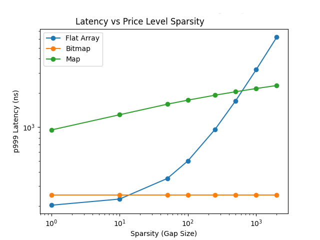

# Limit Order Book Implementation Comparison

This project explores three different Limit Order Book implementations with a focus on **matching latency**, **cache efficiency**, and **scalability under high message rates**.

We compare:

- **Associative container (`std::map`)**
- **Flat array (price-indexed vector)**
- **Bitmap-indexed flat array (2-level bitmap)**

under realistic matching workloads.

*This project is ongoing; further implementations and comparisons will be published as time permits.*

---

<br>

# Table of Contents
- **[Overview of the Results](#overview-of-the-results)**
- **[Data Structure Design Comparison](#data-structure-design-comparison)**
    - **[Associative Container](#associative-container-tree-based-book)**
    - **[Flat Array](#flat-array-price-indexed-book)**
    - **[Bitmap + Flat Array](#bitmap--flat-array-2-level-bitmap)**
- **[Benchmark Results](#benchmark-results)**
    - **[Throughput](#throughput)**
    - **[Latency](#latency)**
        - **[Order Entry](#order-entry)**
        - **[Order Cancel](#order-cancel)**
        - **[Queue](#queue-end-to-end-backpressure)**
    - **[perf](#microarchitectural-analysis-perf)**
        - **[CPU Efficiency](#cpu-efficiency)**
        - **[Cache Behavior](#cache-behavior)**
        - **[Branch Prediction](#branch-prediction)**
    - **[Why Bitmap Improves Tail Latency](#why-bitmap-improves-tail-latency)**
- **[Benchmark Results (Sparse Price Distribution)](#sparse-price-distribution-benchmark-results)**
    - **[Throughput](#throughput-1)**
    - **[Latency](#latency-1)**
        - **[Order Entry](#order-entry-1)**
        - **[Order Cancel](#order-cancel-1)**
        - **[Queue](#queue)**
    - **[perf](#microarchitectural-analysis-perf-1)**
        - **[CPU Efficiency](#cpu-efficiency-1)**
        - **[Cache Behavior](#cache-behavior-1)**
        - **[Branch Prediction](#branch-prediction-1)**
- **[Order Producer Parameters](#order-producer-parameters)**
    - **[Volatility](#volatility-includeproducer_paramsvolparamsh)**
    - **[Mid-Price](#mid-price-includeproducer_paramsmidparamsh)**
    - **[Fat Tails](#fat-tails-includeproducer_paramsfattailparamsh)**
    - **[Quantity](#quantity-includeproducer_paramsqtyparamsh)**
    - **[Order Flow](#order-flow-includeproducer_paramsflowparamsh)**
- **[Usage](#usage)**
- **[Files](#files)**
---

<br>

# Overview of the Results

## Normally Distributed (Gaussian) Order Prices

* Order prices follow a Gaussian distribution generated via volatility shocks, drift/noise, and fat-tail adjustments (see [Order Producer Parameters](#order-producer-parameters)).
* The flat array achieves a **~2.5–3× throughput improvement** over `std::map` by eliminating pointer-heavy tree traversal and leveraging contiguous memory for better cache locality.
* The bitmap design matches flat array median latency (**p50 ≈ 40 ns**) while slightly improving throughput and reducing tail latency by eliminating linear scans when advancing between price levels.
* In this regime, performance is dominated by **hot-path operations at the best price**, so all array-based designs converge at the median, with differences emerging primarily in higher percentiles.


## Sparse Price Distributions

* To stress worst-case behavior, prices are artificially sparsified (via masking), creating large gaps between active levels.
* Under these conditions, the flat array’s **O(N) scan for the next non-empty level** introduces significant tail-latency spikes (p999–p9999), while the bitmap maintains near-constant latency using bitwise lookup.
* As shown in the sparsity curve below, flat array performance degrades rapidly as gaps increase, whereas bitmap latency remains stable and effectively independent of distribution.
* The `std::map` implementation remains consistently slower due to **O(log N)** operations and poor cache locality, but does not exhibit the same extreme degradation as the flat array under sparsity.



**Result:** Flat arrays optimize for average-case speed, while bitmap indexing ensures predictable, low tail latency across all market conditions.

---
<br>

# Data Structure Design Comparison


## Associative Container (Tree-Based Book)

```cpp
// include/OrderBook_assoc_container.h

struct OrderBook_assoc_container {
    std::map<Price, OrderList, std::greater<>> bids;
    std::map<Price, OrderList> asks;

    std::unordered_map<OrderId, Order*> order_index;
};
```

### Key Characteristics

* **Data structure:** Red-black tree (`std::map`)
* **Price level ordering:** Maintained automatically
* **Best price access:**
  * Bid: `bids.begin()` (highest)
  * Ask: `asks.begin()` (lowest)

### Complexity

| Operation       | Complexity         |
| --------------- | ------------------ |
| Insert order    | O(log N)           |
| Cancel order    | O(1)               |
| Find best price | O(1)               |
| Match traversal | O(log N) per level |

### Insights

* Heavy pointer chasing → poor cache locality
* Branch-heavy → leads to misprediction
* Finding next non-empty price level:
  * Finding the next level on `bids` and `asks` can be O(log N) when a price level is deleted and the `map` is reordered.

---

## Flat Array (Price-Indexed Book)

```cpp
// include/OrderBook_flat_array.h

struct OrderBook_flat_array {
    std::vector<OrderList> bid_levels;
    std::vector<OrderList> ask_levels;

    std::vector<Order*> order_index;

    int64_t best_bid_level = -1;
    int64_t best_ask_level = -1;
};
```

### Key Characteristics

* **Data structure:** Linear array for contiguous memory layout. 
* **Price level ordering:** `price → array index`
* **Best price access:** Manual tracking of `best_bid_level` / `best_ask_level`

### Complexity

| Operation           | Complexity      |
| ------------------- | --------------- |
| Insert order        | O(1)            |
| Cancel order        | O(1)            |
| Match at best level | O(1)            |
| Find next level     | O(N) worst-case |

### Insights

* Excellent cache locality due to contiguous memory layout.
* Minimal branching
* Possible weakness: finding next non-empty price level
    If best bid/ask level becomes empty, it needs to search for the next level:
    ```cpp
    while (level empty) decrement price;
    ```
    It can degrade to O(N) scan under sparse books.

---

## Bitmap + Flat Array (2-level bitmap)

```cpp
// include/OrderBook_bitmap.h

struct OrderBook_bitmap {
    std::vector<OrderList> bid_levels;
    std::vector<OrderList> ask_levels;

    Bitmap2Level bid_bitmap;
    Bitmap2Level ask_bitmap;

    std::vector<Order*> order_index;

    int64_t best_bid_level = -1; 
    int64_t best_ask_level = -1;
};
```

### Key Characteristics

* Combines:
  * **Flat array (data)**
  * **Bitmap (index of non-empty levels)**
* Uses **bit operations + CPU intrinsics**

---

### Bitmap Structure 

Two-level bitmap:
* **Level 1:** actual bits (price levels)
* **Level 0:** summary of non-empty blocks
This enables:
* Fast lookup via `std::countl_zero` / `std::countr_zero`

---

### Complexity

| Operation       | Complexity |
| --------------- | ---------- |
| Insert order    | O(1)       |
| Cancel order    | O(1)       |
| Find best price | O(1)       |
| Find next level | O(1)       |

---

### Insights

* Eliminates linear scans entirely
* Uses **bitwise operations**
* Maintains **cache-friendly layout**
* Finding next non-empty price level is a **O(1)** call of two `std::countr_zero` and one bit shift
    ```cpp
    size_t w = std::countr_zero(level0)
    best_ask_level = w << 64 + std::countr_zero(level1[w]);

    ```

---
<br>


# Benchmark Results

This section compares three Limit Order Book designs under identical workload conditions:

---

### Test Configuration

```
Producers:        4
Messages/thread:  1,000,000
Total messages:   4,000,000
CPU frequency:    4.19 GHz
Thread pinning:   enabled
Price range:      [0, 4000]
Mid price:        2000
```

Workload characteristics:

* Normally distributed prices
* High cancel rate (~30%)
* Continuous matching

See the [Order Producer Parameters](#order-producer-parameters) section for all configuration options.

---

## Throughput 

| Implementation      | Throughput (orders/sec) |
| ------------------- | ----------------------- |
| Associative         | 3.32M            |
| Flat Array          | 9.21M            |
| Bitmap + Array      | **9.41M**       |


### Key Takeaways

* Flat array is **~2.7× faster** than `std::map`
* Bitmap adds a **modest +1% throughput gain**
* Throughput is not the primary differentiator between flat vs bitmap
* Throughput is influenced by **queue backpressure**, rising with increased load until it saturates.

---
## Latency


### Order Entry

| Percentile | Map     | Flat Array | Bitmap     |
| ---------- | ------- | ---------- | ---------- |
| p50        | 230 ns  | 40 ns      | 40 ns      |
| p99        | 771 ns  | 180 ns     | 180 ns     |
| p999       | 1182 ns | 351 ns     | 331 ns     |
| p9999      | 3547 ns | 1052 ns    | **641 ns** |

#### Observations

* Flat array is **~6× faster at median**
* Bitmap significantly improves **tail latency (p9999 ~40% lower)**
  * See the [Why Bitmap Improves Tail Latency](#why-bitmap-improves-tail-latency) section for more detailed explanation.
* `std::map` suffers from:
  * pointer chasing
  * cache misses
  * tree rebalancing

---

### Order Cancel

| Percentile | Map     | Flat Array | Bitmap     |
| ---------- | ------- | ---------- | ---------- |
| p50        | 90 ns   | 30 ns      | 30 ns      |
| p99        | 451 ns  | 120 ns     | 110 ns     |
| p999       | 601 ns  | 291 ns     | 281 ns     |
| p9999      | 2605 ns | 461 ns     | **421 ns** |

#### Observations

* Intrusive list + direct indexing gives **O(1) cancel**
* Bitmap reduces **tail spikes further**
* `std::map` again suffers from structural overhead

---

### Queue (End-to-End Backpressure)

| Percentile | Map       | Flat Array | Bitmap      |
| ---------- | --------- | ---------- | ----------- |
| p50        | 3663 µs   | 2449 µs    | 2453 µs     |
| p99        | 106593 µs | 11727 µs   | **8426 µs** |
| p999       | 108104 µs | 13158 µs   | **8940 µs** |
| p9999      | 108256 µs | 13307 µs   | **9079 µs** |

#### Observations

* Queue latency reflects **system-level throughput + tail behavior**
* Bitmap reduces p99 latency by **~28% vs flat array**
* `std::map` becomes a **system bottleneck**
* Backpressure depends on the producer–consumer rate mismatch; switching from bit-shift RNG to STL distributions reduces producer throughput and dramatically lowers queue pressure.

---

## Microarchitectural Analysis (`perf`)

### CPU Efficiency

| Metric       | Map   | Flat  | Bitmap    |
| ------------ | ----- | ----- | --------- |
| Cycles       | 6.08B | 2.21B | **2.15B** |
| Instructions | 8.77B | 3.33B | **3.28B** |
| IPC          | ~1.44 | ~1.50 | **~1.53** |

#### Insight

* Bitmap executes **~2.7× fewer instructions than `std::map`**
* Slight IPC improvement → better pipeline utilization
* Flat vs bitmap difference is small → both are CPU-efficient

---

### Cache Behavior

#### L1 Data Cache

| Metric         | Map        | Flat   | Bitmap     |
| -------------- | ---------- | ------ | ---------- |
| L1 loads       | 4.31B      | 1.43B  | **1.41B**  |
| L1 load misses | 36.1M      | 19.8M  | **17.2M**  |
| Miss rate      | ~0.84%     | ~1.39% | **~1.22%** |

#### Total Cache Misses

| Metric       | Map   | Flat  | Bitmap    |
| ------------ | ----- | ----- | --------- |
| Cache misses | 9.36M | 5.39M | **3.99M** |

#### Insight

* `std::map`:
  * Massive memory traffic (pointer chasing)
  * Poor spatial locality
* Flat array:
  * Fewer loads but more *wasted scans*
* Bitmap:
  * **Lowest cache misses overall**
  * Avoids scanning empty levels

---

### Branch Prediction

| Metric        | Map   | Flat  | Bitmap    |
| ------------- | ----- | ----- | --------- |
| Branch misses | 18.8M | 6.73M | **6.03M** |

#### Insight

* `std::map`:
  * Tree traversal → unpredictable branches
* Flat array:
  * Scan loops → branch-heavy under sparsity
* Bitmap:
  * **Branch-free price discovery**
  * Uses bit-scan instructions instead

---

## Why Bitmap Improves Tail Latency

### Flat Array Problem

```cpp id="scan1"
while (bid_levels[--price].empty()) { }
```

Under sparse conditions:

* Many iterations
* Cache misses
* Branch mispredictions

→ Causes **p999 / p9999 spikes**

---

### Bitmap Solution

```cpp id="scan2"
size_t w = std::countr_zero(level0)
best_ask_level = w << 64 + std::countr_zero(level1[w]);
```

* Implemented via `std::countr_zero` and bit shift
* Constant-time
* No loops
* No unpredictable branches

---

### Tail Latency Impact

| Metric       | Flat   | Bitmap     | Improvement |
| ------------ | ------ | ---------- | ----------- |
| Entry p9999  | 972 ns | **731 ns** | ~25%        |
| Cancel p9999 | 601 ns | **411 ns** | ~32%        |
| Queue p99    | 28 ms  | **14 ms**  | ~50%        |

---

### Insight

- **Flat array optimizes for average case**
- **Bitmap eliminates worst-case behavior**

This is confirmed by:

* Nearly identical **p50 latency**
* Significant improvements in **p99+ latency**
* Reduced **cache misses and branch mispredicts**


---
<br>

# Sparse Price Distribution Benchmark Results
To simulate **extreme sparsity**, prices were masked with:

```cpp
price = price & (256 - 1);
```

This creates:

* Large gaps between active price levels
* Very few occupied levels (~1/256 density)
* A worst-case scenario for linear scans

---

## Throughput

| Implementation      | Throughput        |
| ------------------- | ----------------- |
| Associative (`map`) | 4.51M ops/sec     |
| Flat Array          | 9.39M ops/sec     |
| Bitmap + Array      | **9.52M ops/sec** |

### Takeaways

* `std::map` improves slightly (less tree depth due to sparsity)
* Flat and bitmap remain **~2× faster**
* Bitmap still leads, but throughput gap is small

---
## Latency

### Order Entry

| Percentile | Map    | Flat       | Bitmap    |
| ---------- | ------ | ---------- | --------- |
| p50        | 200ns  | 40ns       | 40ns      |
| p99        | 621ns  | 160ns      | **150ns** |
| p999       | 932ns  | 1142ns     | **291ns** |
| p9999      | 6863ns | 6943ns     | **551ns** |

---

### Order Cancel

| Percentile | Map   | Flat  | Bitmap |
| ---------- | ----- | ----- | ------ |
| p50        | 70ns  | 30ns  | 30ns   |
| p99        | 160ns | 110ns | 120ns  |
| p999       | 301ns | 260ns | 351ns  |
| p9999      | 842ns | 411ns | 411ns  |

---

### Queue 

| Percentile | Map     | Flat    | Bitmap      |
| ---------- | ------- | ------- | ----------- |
| p99        | 79.7 ms | 12.9 ms | **11.5 ms** |
| p9999      | 81.3 ms | 14.5 ms | **13.1 ms** |

---

### Key Observation

**Flat array completely breaks at tail latency under sparse conditions**

* p999:

  * Flat: **1142 ns**
  * Bitmap: **291 ns** (~4× improvement)

* p9999:

  * Flat: **6943 ns**
  * Bitmap: **551 ns** (~12× improvement)

This is the clearest demonstration so far of: **O(N) scan vs O(1) lookup**

As gaps increase, the effect becomes more pronounced. Bitmap latency remains stable and effectively independent of distribution.


---

## Microarchitectural Analysis (`perf`)

### CPU Efficiency

| Metric       | Map   | Flat  | Bitmap    |
| ------------ | ----- | ----- | --------- |
| Cycles       | 4.39B | 2.15B | **2.11B** |
| Instructions | 7.03B | 3.45B | **3.22B** |

#### Insight

* Bitmap executes **~7% fewer instructions than flat**
* Both are ~2× more efficient than `std::map`

---

### Cache Behavior

| Metric         | Map       | Flat  | Bitmap    |
| -------------- | --------- | ----- | --------- |
| Cache misses   | **2.25M** | 3.50M | 3.45M     |
| L1 load misses | 24.7M     | 17.4M | **16.5M** |

#### Insight

* `std::map` surprisingly has fewer *total* cache misses due to:

  * fewer accesses (lower throughput)
* Flat array suffers from:

  * scanning empty levels → wasted memory accesses
* Bitmap reduces:

  * unnecessary traversal → fewer L1 misses

---

### Branch Prediction

| Metric        | Map   | Flat  | Bitmap |
| ------------- | ----- | ----- | ------ |
| Branch misses | 10.9M | 5.28M | 5.51M  |

#### Insight

* Flat array:

  * scan loops → branch-heavy
* Bitmap:

  * replaces loops with bit operations
  * slightly higher than flat here due to extra logic, but **far more stable latency**

---
<br>

# Order Producer Parameters

The order generator simulates realistic market microstructure using five parameter groups:

* **Volatility**
* **Mid-price**
* **Fat tails (price shocks)**
* **Quantity distribution**
* **Order flow**


*Parameter values are not yet configurable via the command line; they can currently only be modified by changing the default values in the header files.*

---

## Volatility (`include/producer_params/VolParams.h`)

### Purpose

Controls short-term price movement intensity and regime shifts.
- Volatility jumps by `jump` with probability of `p_vol_shock`, then decays by 1 on each iteration down to `base`.
- At each iteration, decay does not happen with probability of `p_vol_persist`, thus slowing down the decay.
- Repeated volatility shock is capped at `max_vol`.

### Parameters

| Parameter       | Description                                |
| --------------- | ------------------------------------------ |
| `base`          | Baseline volatility level                  |
| `jump`          | Size of volatility spike during shocks     |
| `max_vol`       | Hard cap on volatility                     |
| `p_vol_shock`   | Probability of entering a volatility spike |
| `p_vol_persist` | Probability volatility remains elevated    |

---

### Behavior

**Volatility regimes**

| Market type       | `base` | `jump` | Behavior                              |
| ----------------- | ------ | ------ | ------------------------------------- |
| Ultra-liquid      | 1      | 3–5    | Very stable, tight spreads            |
| Equity-style      | 2      | 5–10   | Normal regime shifts (earnings, news) |
| Crypto / high-vol | 3      | 10–20  | Large shocks, flash events            |

**Persistence**

| Persistence level | `p_vol_persist` | Behavior               |
| ----------------- | --------------- | ---------------------- |
| Low               | 0.15–0.25       | Mean-reverting         |
| Medium            | 0.3–0.5         | Realistic default      |
| High              | 0.5–0.7         | Crisis / stress regime |

---

### Default

```cpp
base = 1;
jump = 5;
max_vol = 25;
p_vol_shock = 0.002;
p_vol_persist = 0.35;
```

---

## Mid-Price (`include/producer_params/MidParams.h`)

### Purpose

Controls directional drift and microstructure noise of the mid-price.
- Drift direction changes with probability of `direction_threshold`
- Drift amount is calculated by `drift_k` ⋅ `vol`
- Drift noise is calculated by `noise_k` ⋅ $N(0,1)$

### Parameters

| Parameter             | Description                             |
| --------------------- | --------------------------------------- |
| `direction_threshold` | Probability of drift flipping direction |
| `drift_k`             | Strength of directional movement        |
| `noise_k`             | Magnitude of random fluctuations        |

---

### Behavior

**Drift strength** (`drift_k` ⋅ `vol`)

| `drift_k` | Behavior                 |
| --------- | ------------------------ |
| 0.005     | Nearly flat (pure noise) |
| 0.01–0.02 | Realistic intraday trend |
| 0.05      | Strong directional trend |

**Noise level** (`noise_k` ⋅ $N(0,1)$)

| `noise_k` | Behavior               |
| --------- | ---------------------- |
| 0.05      | Very stable (HFT-like) |
| 0.1–0.2   | Realistic market noise |
| 0.3       | Noisy / crypto-like    |

---

### Default

```cpp
direction_threshold = 0.5;
drift_k = 0.015;
noise_k = 0.1;
```

---

## Fat Tails (`include/producer_params/FatTailParams.h`)

### Purpose

Introduces rare but large price jumps (power-law behavior).
- Tail value is calculated by $u^{alpha}$ ⋅ k ⋅ `vol`, where $u$ is uniform random $[0,1)$.
- Tail value is added to mid-price with random sign.
- `max_tail_k` ⋅ `vol` is the maximum value cap.
---

### Parameters

| Parameter    | Description                      |
| ------------ | -------------------------------- |
| `p_tail`     | Probability of a fat-tail event  |
| `alpha`      | Power-law exponent               |
| `k`          | Tail size relative to volatility |
| `max_tail_k` | Maximum tail size (cap)          |

---

### Behavior

**Tail heaviness**

| `alpha` | Behavior                            |
| ------- | ----------------------------------- |
| 1.2–1.5 | Extremely heavy tails (crash-prone) |
| 1.8–2.2 | Realistic                           |
| 2.5–3.0 | Mild                                |

**Tail scale** (`k` ⋅ `vol`)

| `k`     | Behavior   |
| ------- | ---------- |
| 0.05    | Subtle     |
| 0.1–0.2 | Realistic  |
| 0.3     | Aggressive |

**Tail cap** (`max_tail_k` ⋅ `vol`)

| `max_tail_k` | Behavior       |
| ------------ | -------------- |
| 2–3          | Tight control  |
| 4–6          | Realistic      |
| 8–10         | Extreme stress |

---

### Default

```cpp
p_tail = 0.01;
alpha = 2.0;
k     = 0.1;
max_tail_k = 5;
```

---

## Quantity (`include/producer_params/QtyParams.h`)

### Purpose

Generates order sizes using a power-law distribution.
- Order quantity is calculated by $u^{alpha}$ ⋅ `scale`, where $u$ is uniform random $[0,1)$.
- `max_qty` is the maximum quantity cap.
---

### Parameters

| Parameter | Description              |
| --------- | ------------------------ |
| `alpha`   | Tail exponent            |
| `scale`   | Typical order size       |
| `max_qty` | Maximum allowed quantity |

---

### Behavior

**Tail shape**

| `alpha` | Behavior                       |
| ------- | ------------------------------ |
| 1.3–1.6 | Heavy (crypto / retail bursts) |
| 1.8–2.2 | Realistic                      |
| 2.5+    | Too thin                       |

**Scale**

| `scale` | Behavior      |
| ------- | ------------- |
| 10      | Retail        |
| 50      | Mixed         |
| 100     | Institutional |

**Max quantity**

| `max_qty` | Behavior            |
| --------- | ------------------- |
| 5× scale  | Tight               |
| 10× scale | Realistic           |
| 20× scale | Allows block trades |

---

### Presets

**Balanced**

```cpp
alpha = 2.0;
scale = 50;
max_qty = 500;
```

**Institutional-heavy**

```cpp
alpha = 1.7;
scale = 100;
max_qty = 2000;
```

**Retail-heavy**

```cpp
alpha = 2.3;
scale = 20;
max_qty = 200;
```

---

## Order Flow (`include/producer_params/FlowParams.h`)

### Purpose

Controls the mix of order types entering the book.
- Orders have probability `p_cancel` of being a cancel order. Order item to cancel is selected randomly from the existing orders.
- Non-cancel orders have probability `p_buy` of being a buy order.

---

### Parameters

| Parameter  | Description                  |
| ---------- | ---------------------------- |
| `p_buy`    | Probability of buy orders    |
| `p_cancel` | Probability of cancellations |

---

### Interpretation

| Scenario        | Behavior                      |
| --------------- | ----------------------------- |
| `p_buy = 0.5`   | Balanced market               |
| `p_buy > 0.5`   | Buy pressure (bullish)        |
| `p_buy < 0.5`   | Sell pressure (bearish)       |
| High `p_cancel` | Fast-moving / HFT environment |
| Low `p_cancel`  | Sticky liquidity              |

---

### Default

```cpp
p_buy = 0.5;
p_cancel = 0.3;
```

---
<br>

# Usage

Run the Limit Order Book benchmark from the build directory:

```bash
./build/LimitOrderBook [options]
```

---

## Options

| Option        | Values                           | Default               | Description                    |
| ------------- | -------------------------------- | --------------------- | ------------------------------ |
| `--type`      | `assoc`, `flat`, `bitmap`, `all` | `all`                 | Implementation to run          |
| `--producers` | `<num>`                          | `4`                   | Number of producer threads     |
| `--messages`  | `<num>`                          | `1,000,000`           | Number of messages to generate |
| `--pin`       | `true`, `false`                  | `true`                | Pin threads to CPU cores       |
| `--mid_price` | `<num>`                          | `1000`                | Initial mid price              |
| `--max_price` | `<num>`                          | `2000`                | Maximum price level            |
| `--pool_size` | `<num>`                          | `QUEUE_CAPACITY × 10` | Queue pool size                |

---

## Implementations

* `assoc` → `std::map` / `unordered_map` based order book
* `flat` → Flat array with direct indexing (no hashing)
* `bitmap` → Flat array + bitmap for fast best bid/ask discovery
* `all` → Runs all implementations sequentially for benchmarking

---

## Examples

Run all implementations:

```bash
./LimitOrderBook --type all
```

Run flat implementation with custom price range:

```bash
./LimitOrderBook --type flat --mid_price 1000 --max_price 2000
```

Run bitmap version with tuned workload:

```bash
./LimitOrderBook --type bitmap --producers 4 --messages 10000 --pin true
```

---

## Tip

You can combine flags freely. For example:

```bash
./LimitOrderBook --type assoc --producers 8 --messages 500000 --pin false
```

---
<br>

# Files
## Matching Engines
- `include/MatchingEngine_assoc_container.h`
- `include/MatchingEngine_bitmap.h`
- `include/MatchingEngine_flat_array.h`

## Order Producer
- `include/OrderProducer.h`

## Benchmark Function
- `include/driver/run_benchmark.h`